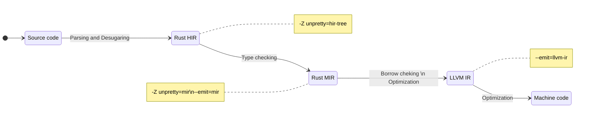

# The compilation process

---
hideInToc: true
---

# The Abstract Machine

- is not a runtime, and does not have any runtime overhead, but is a computing
  model abstraction,
- contains concepts such as memory regions (stack, …), execution semantics, …
- knows and sees things your CPU might not care about,
- is de-facto a contract between you and the compiler,
- and exploits all of the above for optimizations.

---
hideInToc: true
---

# The compilation process

