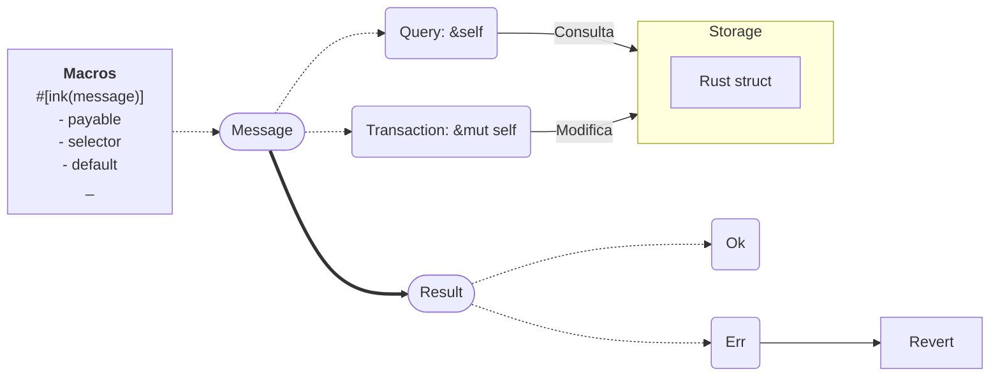
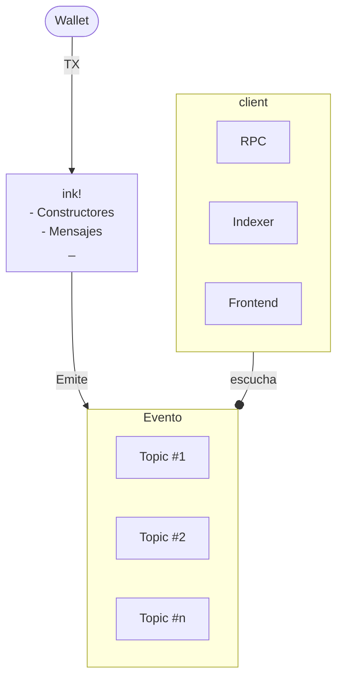

# Ink Overview

---
hideInToc: true
---

# Mensajes

---
hidenInToc:true
---
# Deployment en nodo local

1. Compilar

    `cargo contract build`

2. Correr nodo local

    `substrate-contracts-node`

3. Contracts UI

    `contracts-ui.substrate.io`

---
hidenInToc:true
---

Eventos 

---
hideInToc: true
---
# Data flow

---
hidenInToc: true
---
# Ink modules

