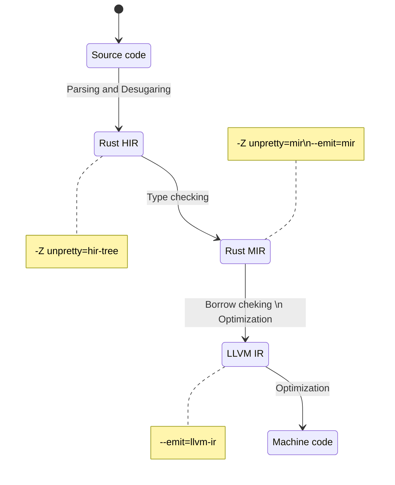

## Diagrams

## REFERENCES
- [Dec/22 - Rust Software Security: A Current State Assessment](https://insights.sei.cmu.edu/blog/rust-software-security-a-current-state-assessment/)
- [Jan/23 - Rust Vulnerability Analysis and Maturity Challenges](https://insights.sei.cmu.edu/blog/rust-vulnerability-analysis-and-maturity-challenges/)
- [2022 CWE Top 25 Most Dangerous Software Weaknesses](https://cwe.mitre.org/top25/archive/2022/2022_cwe_top25.html)
- [Oct/22 - An error propagation operator (C++)](https://www.open-std.org/jtc1/sc22/wg21/docs/papers/2022/p2561r1.html)
