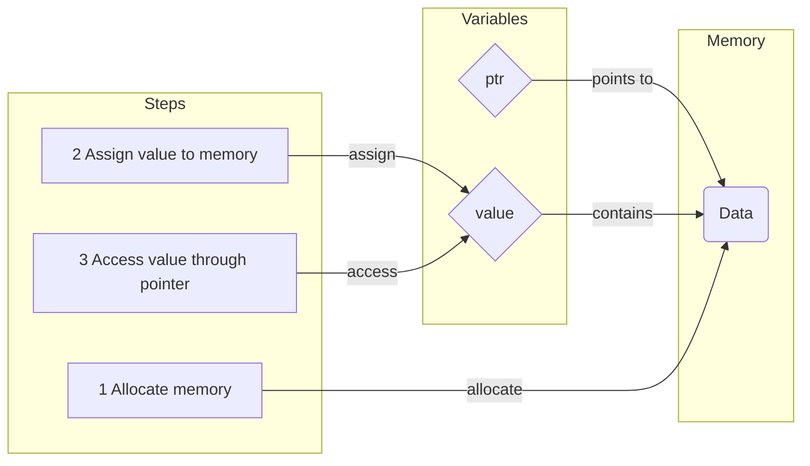

# Rust Workshop

Danyiel Colin

  
    Let's start! 🦀 <carbon:arrow-right class="inline"/>
  

  <button @click="$slidev.nav.openInEditor()" title="Open in Editor" class="text-xl slidev-icon-btn opacity-50 !border-none !hover:text-white">
    <carbon:edit />
  </button>
  <a href="https://github.com/slidevjs/slidev" target="_blank" alt="GitHub"
    class="text-xl slidev-icon-btn opacity-50 !border-none !hover:text-white">
    <carbon-logo-github />
  </a>

---

# Goals of the Workshop
1. Familiarity with `cargo` workflow (TDD, deps)
2. Understand `mods` & project structure
3. Get an panoramic view of the Rust ecosystem
4. Gain intuitions when reading source code

---

# Table of contents

<Toc columns=2></Toc>

---
transition: slide-up
src: ./pages/1_introduction.md
---

---
transition: slide-up
src: ./pages/2_workflow.md
---

---
transition: slide-up
src: ./pages/3_syntax_a.md
---

---
transition: slide-up
src: ./pages/4_syntax_b.md
---

---
transition: slide-up
src: ./pages/5_features.md
---

---
transition: slide-up
src: ./pages/6_compilation.md
---

---
transition: slide-up
src: ./pages/7_exercise.md
---

---
transition: slide-up
src: ./pages/8_beyond.md
---

# A classic pointer

# benches

---
layout: center
class: text-center
---

# Learn More

[Documentations](https://sli.dev) · [GitHub](https://github.com/slidevjs/slidev) · [Showcases](https://sli.dev/showcases.html)
